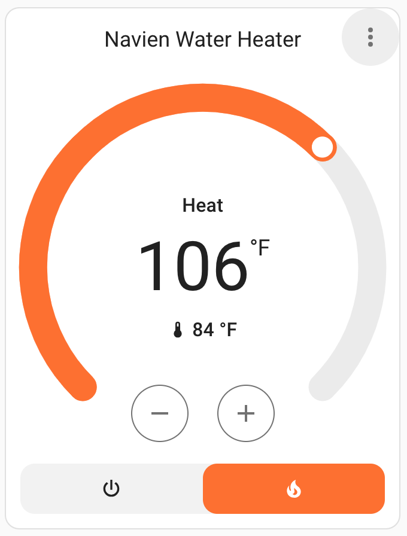
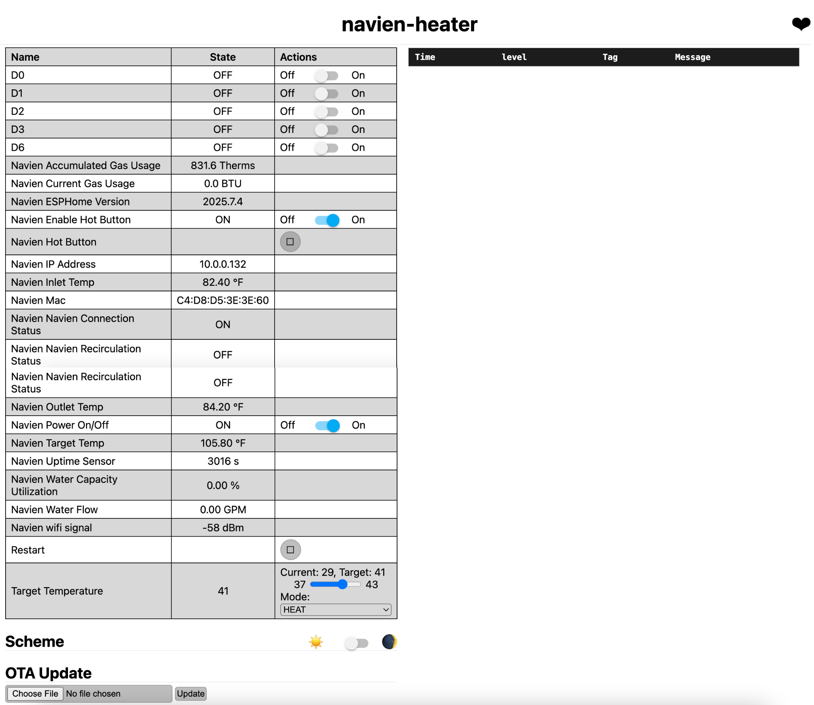

# Navien ESPHome Integration 🚀🔥

Take control of your **Navien gas water heater** directly from Home
Assistant with this ESPHome module!

No more proprietary lock-ins - this project lets you seamlessly
integrate your Navien system into your smart home setup, giving you
automation superpowers like:

-   📱 Remote start/stop from Home Assistant
-   🔔 "Hot Button" entity that can be triggered from automation
-   ⚡ Climate control for setting the target temperature
-   🛠️ Easy to build, flash, and configure with YAML

## Screenshots 🖼️

Here are some examples of how the integration looks in Home Assistant:




This project grew out of my work on reverse engineering the native Navien communication protocol to automate my Navien 240a, which it is tested with thoroughly (and works in my home every day). It also incorporates the knowledge from work done by amazing folks in Home Assistant community: [tsquared](https://github.com/tsquared96), [https://github.com/Suva](https://github.com/Suva), [evanjarrett](https://github.com/evanjarrett), David Carson, smurf12345 and many others who contributed in the [community thread](https://community.home-assistant.io/t/navien-esp32-navilink-interface/720567/118)

👉 GitHub Repo: [htumanyan/navien](https://github.com/htumanyan/navien)

------------------------------------------------------------------------

## Getting Started 🛠️

Follow these steps to build and run your own Navien ESPHome integration.

### 1. Clone the Repository

```
git clone https://github.com/htumanyan/navien.git 
cd navien
```

### 2. Install ESPHome

If you don't already have ESPHome installed:

```
pip install esphome
```

For detailed installation instructions, see the [ESPHome Getting Started
guide](https://esphome.io/guides/getting_started_command_line.html).

### 3. Choose Your Configuration

There are two ready-to-use YAML configurations in this repo:

-   **navien-d1-mini.yml** → If you use the D1 Mini board
-   **navien-wrd-hb.yml** → Version for D1 Mini with a hardwired hot button simulator
-   **navien-esphome-atom-lite-esp32.yml** → If you use esp32 Atom Lite board
-   **navien-ht-device.yml** → This is for custom esp device that I've designed and plan to open source soon

### 5. Configure Wi-Fi

```
cp secrets.yaml.sample secrets.yaml
```
Edit secrets.yaml - change XXXX to your Wi-Fi network/password and AP SSID network/password in case if it fails to acquire Wi-Fi connection

### 6. Compile and Upload

Compile your firmware:

```
bash esphome compile navien-wrd-hb.yml 
```

**IMPORTANT: ensure that you are running the latest version of esphome, 2025.11.4 or later. Esphome introduced incompatible changes after the version 2025.7.4 that this repo was based off of. Hence it is critical to ensure the latest version of esphome is applied.**


Flash it to your ESP32:

```
bash esphome run navien-wrd-hb.yml
```

### 7. Hardware

#### [Connecting to Navien-240](./doc/240.md)

---

### 8. Importing the Scheduled Recirculation Automation Blueprint

If you have a unit, such as the NPE2 series, that supports scheduled recirculation (meaning it has recirculation modes named something like "Always", "Intelligent", "Weekly", etc), and setting your unit to one of those modes results in the "Navien Recirculation Mode" sensor in Home Assistant reporting "External Scheduled" or "Internal Scheduled", then you can likely use the automation blueprint for scheduling your unit's recirculation times. To do that:

First, you need to create a Schedule entity that will control when circulation is active:

1. In Home Assistant, go to "Settings", "Devices and Services"
2. Click "Add integration"
3. Find "Schedule (helper)" and select it
4. Give the schedule a name like "Navien Recirculation", and set up the schedule (or you can do that part later)
5. Click "Create"

Then, set up the automation:

1. In Home Assistant, go to "Settings", "Automations & scenes", then to the "Blueprints" tab.
2. Click "Import Blueprint" in the lower-right corner
3. Enter Blueprint address: `https://raw.githubusercontent.com/htumanyan/navien/refs/heads/main/navien_schedule_automation_blueprint.yaml`
4. Click "Preview", then "Import blueprint"
5. In the list of blueprints, "Navien Scheduled Recirculation" should now appear. Click it.
6. Fill in all the values per the directions (you might need to create some more helper entities depending on how you want to do things)
7. Click "Save" and give the new automation a name.

### 📖 User Manual for Custom Navien Controller

For detailed instructions on connecting, configuring, and using the custom Navien controller device, see the [User Manual](./user_manual.md). This guide covers hardware setup, wiring, and usage tips specific to the custom controller.

------------------------------------------------------------------------

## [Protocol Details](./doc/README.md) 🔬

If you're interested in how this integration works under the hood, check
out the [doc](./doc/README.md) subfolder.
It contains the **reverse-engineered details of the Navien
protocol**---including message formats, field definitions, and notes
from packet captures.

This section is for developers and contributors who want to:
- Understand the low-level communication between the ESP32 and Navien
heater
- Contribute improvements to the protocol implementation
- Extend support for additional Navien models or features

If you just want to use the integration, you don't need to worry about
this --- but if you love digging into protocols, that's where the magic
happens.

------------------------------------------------------------------------

## Next Steps 🌟

-   Add your device to **Home Assistant** using ESPHome integration.
-   Create **automations and dashboards** to trigger hot water
    recirculation with a tap, schedule, or voice assistant.
-   Share your setup and feedback with the community!

------------------------------------------------------------------------

💡 This project is community-driven. Contributions, pull requests, and
feature ideas are always welcome!
