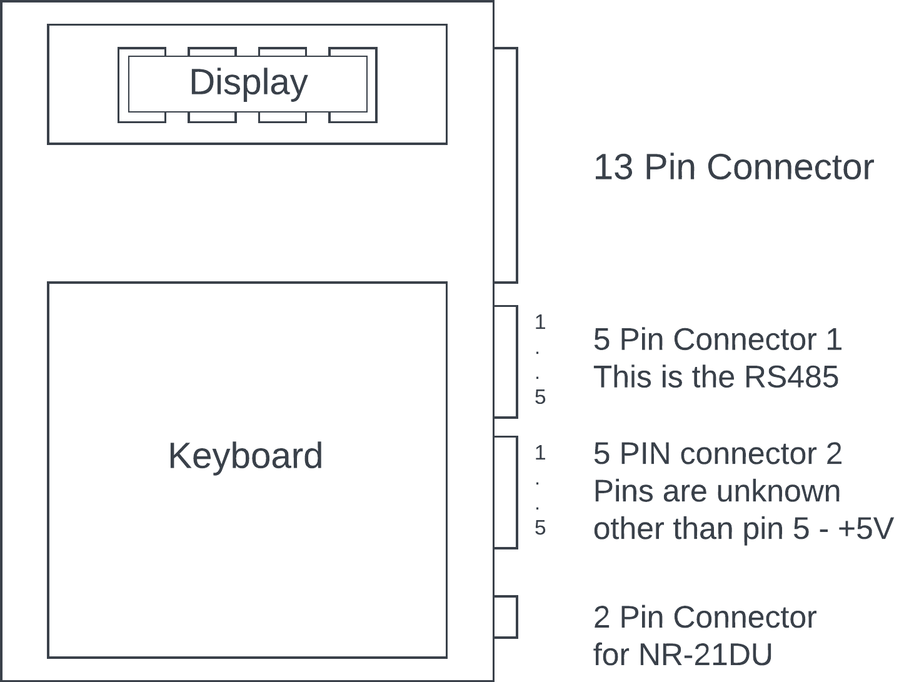
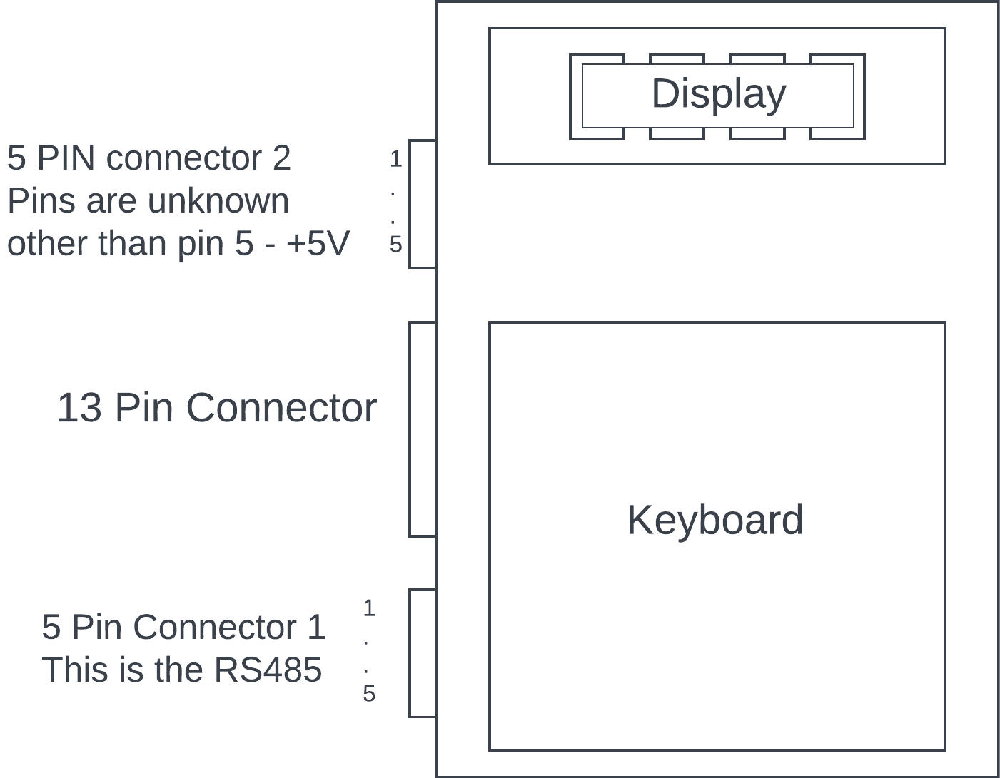

# Navien-240 hardware (240A / 240A2)

## Overview

This page is based on my research and experimentation, as well as contributions from the Home Assistant community, about the Navien-240 models (240A and 240A2) electronic internals.

## Front Display

### 240A

### 240A2

## 5 Pin Connector 1 - RS-485 connection

| Pin | Purpose  |
|--------|-----------------------------------------|
| 1   | Unknown. Some reports indicate +13V in Navien-240A version |
| 2   | RS-485 B- |
| 3   | RS-485 A+ |
| 4   | Unknown   |
| 5   | GND       |

## 5 Pin Connector 2 - Largely Unknown, but has +5V

| Pin | Purpose  |
|--------|-----------------------------------------|
| 1   | Unknown |
| 2   | Unknown |
| 3   | Unknown |
| 4   | Unknown |
| 5   | +5V     |

I've used the +5V to supply power to esp-8266, appears to have enough for it.

## 8 Pin RJ45 Connector (the one that comes with a NaviLink Lite)

If you want to use the cable that comes with the NaviLink Lite to connect via an RJ45 breakout board, here's the mapping to the 5 Pin connector 1:

| RJ45 Pin | Equiv. on connector 1 | Purpose   |
|----------|-----------------------|-----------|
| 1, 2     | 1                     | +13V?     |
| 4        | 3                     | RS-485 A+ |
| 5        | 2                     | RS-485 B- |
| 7, 8     | 5                     | GND       |

